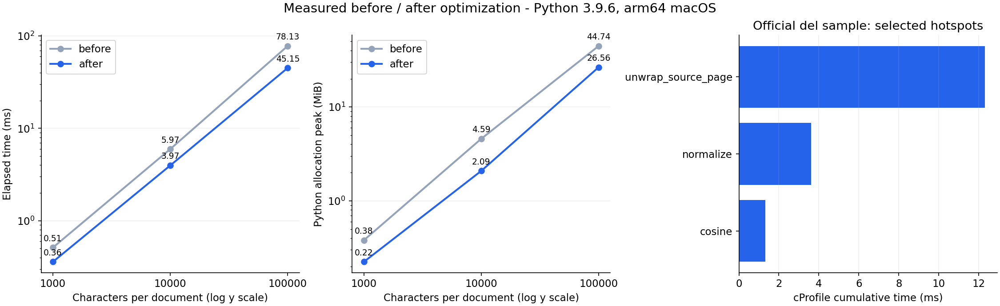
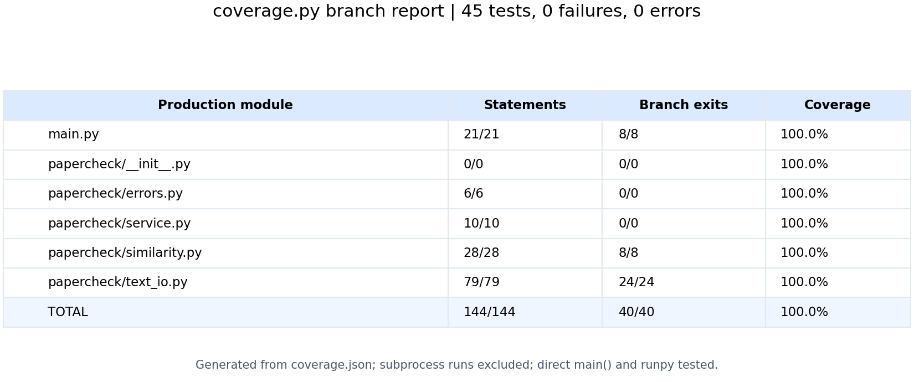

GitHub：[SchoolWork-PaperSimilarity / 3123004519](https://github.com/Cy3807/SchoolWork-PaperSimilarity/tree/main/3123004519)

| 项目 | 内容 |
| --- | --- |
| 所属课程 | [软件工程](https://edu.cnblogs.com/campus/gdgy/Class78-Grade2024-CS) |
| 作业要求 | [第一次个人编程作业](https://edu.cnblogs.com/campus/gdgy/Class78-Grade2024-CS/homework/15702) |
| 作业目标 | 实现论文文本相似度计算，完成测试和性能分析 |
| 姓名、学号 | 陈昱绰，3123004519 |

## 一、实现思路

这次用 Python 写了一个命令行程序，接收原文、对照文本和答案文件三个路径，最后输出一个保留两位小数的相似度。

算法选了字符二元片段加余弦相似度。例如 `abcd` 会拆成 `ab、bc、cd`，统计各片段出现的次数，再比较两个词频向量。这样不用额外安装中文分词库，也不用加载词典。余弦的计算方式是 `两向量的点积 / 两向量长度的乘积`。

计算前先统一全半角和大小写，去掉空白、标点，只保留文字和数字。清洗后完全相同就返回 1；只有一个字符时退回单字符比较；没有有效文字则报错。这个分数主要反映字面相似程度，对同义词替换和大幅改写的判断仍然有限。

代码分成几个部分：

| 文件 | 主要接口和用途 |
| --- | --- |
| `main.py` | `main(argv)`，解析参数，输出结果和错误信息 |
| `papercheck/text_io.py` | `read_paper(path)`、`write_answer(path, score)`，处理编码、读取和写入 |
| `papercheck/similarity.py` | `normalize(text)`、`similarity(original, candidate)`，清洗文字、计算相似度 |
| `papercheck/service.py` | `compare_files(original, candidate, answer)`，连接完整流程 |
| `papercheck/errors.py` | 定义统一的业务异常 |

运行方式：

```powershell
python main.py "D:\texts\orig.txt" "D:\texts\copy.txt" "D:\texts\answer.txt"
```

程序只依赖标准库，提供了 `requirements.txt`。运行时不联网，也不创建日志或 Python 字节码缓存。

## 二、PSP 记录

本次代码和文档使用 AI 辅助完成，测试数据来自实际运行。下表的“实际”记录的是本次 AI 辅助流程的活动时间，不作为学生个人历史工时；设计相关阶段合并统计，等待下载样例的时间未计入。原始记录保存在 `reports/worklog.json`。

| PSP 阶段 | 预估（分钟） | 实际（分钟） |
| --- | ---: | ---: |
| 计划 | 2 | 0.88 |
| 需求分析 | 5 | 1.58 |
| 设计文档、复审、规范与具体设计 | 9 | 2.21 |
| 编码与性能改进 | 8 | 7.18 |
| 代码复审 | 3 | 0.27 |
| 测试 | 6 | 1.22 |
| 测试报告 | 4 | 2.30 |
| 工作量统计 | 1 | <0.01 |
| 总结与博客整理 | 3 | 4.07 |
| 合计 | 41 | 19.71 |

## 三、性能分析与改进

Python 版本使用 `cProfile` 定位耗时，再用 `perf_counter` 比较运行时间。内存分别使用 `tracemalloc` 和 macOS 的 `/usr/bin/time -l` 测量。

实际打开课堂样例后发现，四个 `.txt` 文件里面是 GitHub 源码网页。如果直接比较整份内容，导航和页面代码也会参与计算。所以增加了正文提取，只读取正文单元格中的文字。首版会解析整个网页，分析后改为先找到正文区域，再交给解析器处理。

另一个改动是取消二元片段的中间列表，并直接用 `Counter` 的稀疏频数计算点积，不再为全部特征建立两个完整列表。首版代码保存在 `tools/baseline.py` 和 `tools/baseline_io.py`，方便对照。

测试环境为 arm64 macOS、Python 3.9.6。合成文本使用固定随机种子，每七个字符替换一个字符；同一输入交替运行五次，取时间中位数。内存另测，避免内存追踪影响计时。

| 每篇文本长度 | 首版时间 | 改进后时间 | 首版 Python 分配峰值 | 改进后峰值 |
| --- | --- | --- | --- | --- |
| 1,000 字符 | 0.51 ms | 0.36 ms | 0.38 MiB | 0.22 MiB |
| 10,000 字符 | 5.97 ms | 3.97 ms | 4.59 MiB | 2.09 MiB |
| 100,000 字符 | 78.13 ms | 45.15 ms | 44.74 MiB | 26.56 MiB |

课堂 `del` 样例的正文提取加计算，从 15.30 ms 降至 11.45 ms。完整命令行另测，包含解释器启动，六组运行约 30～39 ms；`del` 组整个进程最大驻留内存为 13.52 MiB。Python 分配峰值和进程内存是不同口径，不能混用。



图右边来自改进后的 `cProfile` 结果，正文提取仍是主要热点。带性能分析器的时间有额外开销，不直接当作普通运行耗时。原始结果在 `reports/performance.json` 和 `reports/profile.txt`。

## 四、测试

单元测试共 45 项，全部通过。用例包括：相同文本、已知结果的二元片段、完全不同、大小写和全半角、单字符、删减文本、空文本、三种编码、网页正文提取、中文及带空格路径、输入不存在、无法写入、答案覆盖输入，以及实际命令行调用。

简单的计算用例如下，`abcd` 与 `abce` 的两个公共片段是 `ab、bc`，期望值可以手算，避免只验证程序能不能运行。

```python
def test_known_bigram_result(self):
    self.assertAlmostEqual(similarity("abcd", "abce"), 2 / 3)


def test_completely_different(self):
    self.assertEqual(similarity("甲乙丙丁", "abcd"), 0.0)
```

此外，把程序复制到临时目录后运行，比较前后的文件列表，确认只新增指定的答案文件。

使用 `coverage.py` 测量程序入口和核心模块，144 条可执行语句全部覆盖，40 个分支出口全部覆盖，分支覆盖率为 100%。命令行子进程没有计入这份覆盖率，入口另外通过直接调用和 `runpy` 验证。图片由真实 JSON 报告生成，原始报告也保存在仓库中。



课堂样例以 `orig.txt` 为原文，输出如下：

| 对照文件 | 相似度 |
| --- | --- |
| `orig.txt` | 1.00 |
| `orig_0.8_add.txt` | 0.90 |
| `orig_0.8_del.txt` | 0.90 |
| `orig_0.8_dis_1.txt` | 0.97 |
| `orig_0.8_dis_10.txt` | 0.91 |
| `orig_0.8_dis_15.txt` | 0.75 |

文件名里的 `0.8` 不作为本算法的标准答案。以上是已取得样例的实测结果，不包含未公开的隐藏测试。

代码规范使用 Ruff 检查，当前没有检查告警，格式检查也通过。

## 五、异常处理

异常统一继承 `PaperError`，在命令行入口捕获，显示中文提示。参数错误退出码为 2，其他业务错误为 1。

| 异常 | 处理的问题 | 对应测试举例 |
| --- | --- | --- |
| `PaperError` | 统一捕获业务错误，避免直接输出调用栈 | `test_cli_missing_file` |
| `ArgumentError` | 参数数量不是三个 | `test_cli_missing_arguments` |
| `InputFileError` | 输入不存在、无法读取，或网页缺少正文 | `test_missing_input`、`test_missing_webpage_body` |
| `TextEncodingError` | 文件编码无法解析，继承输入异常 | `test_invalid_encoding`、`test_incomplete_utf16` |
| `EmptyTextError` | 清洗后为空，或者特征向量为空 | `test_empty_text_rejected`、`test_cosine_empty_vectors` |
| `OutputFileError` | 输出路径无效、写入失败或覆盖输入 | `test_unwritable_output`、`test_input_overwrite_rejected` |

## 六、总结

这次比较有用的一点是先检查输入，再考虑算法。文件后缀是 `.txt`，里面却不一定只有正文，这会直接影响结果。性能优化也没有改计算公式，主要减少了网页解析和中间列表的开销。

目前程序能完成课堂样例和已设计的测试，但字面片段相同不等于语义相同。如果继续改进，可以再比较不同片段长度对改写文本的影响。
